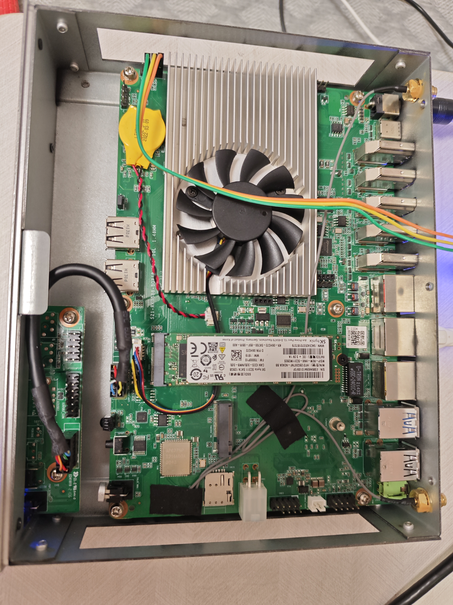
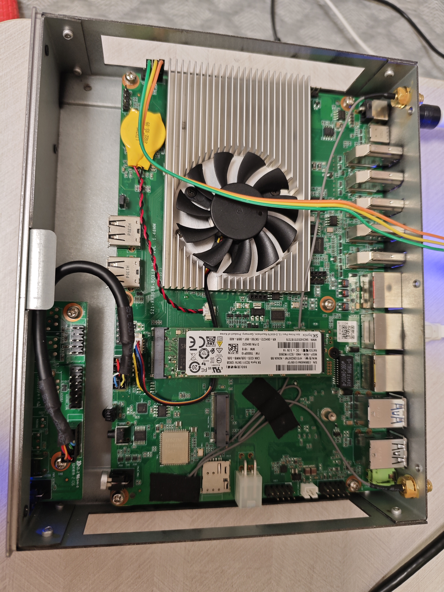
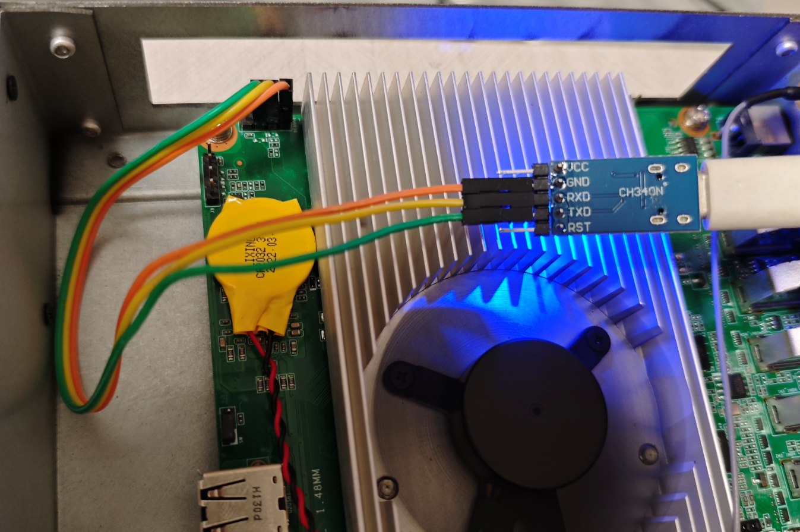
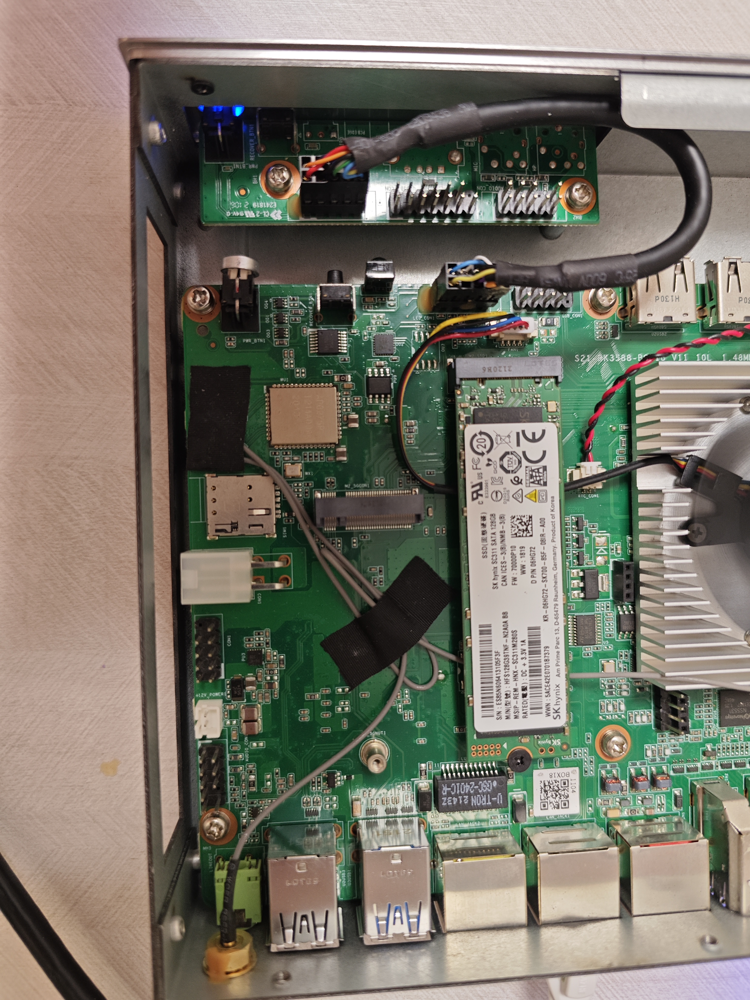
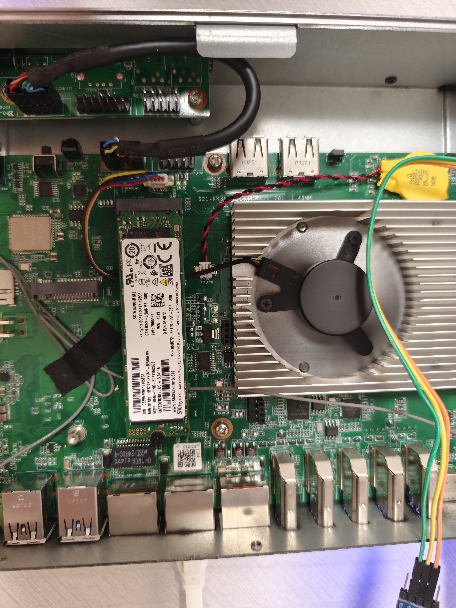
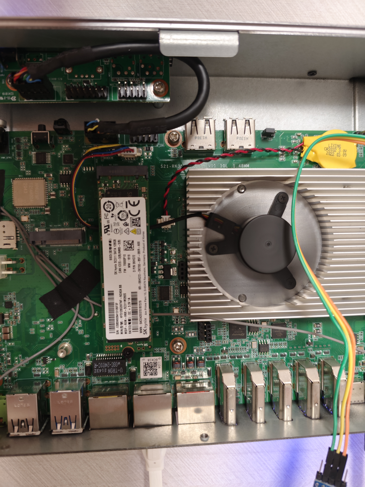
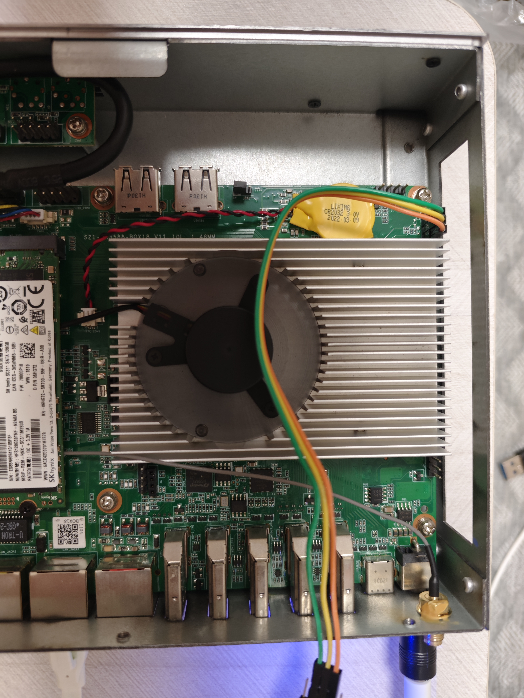
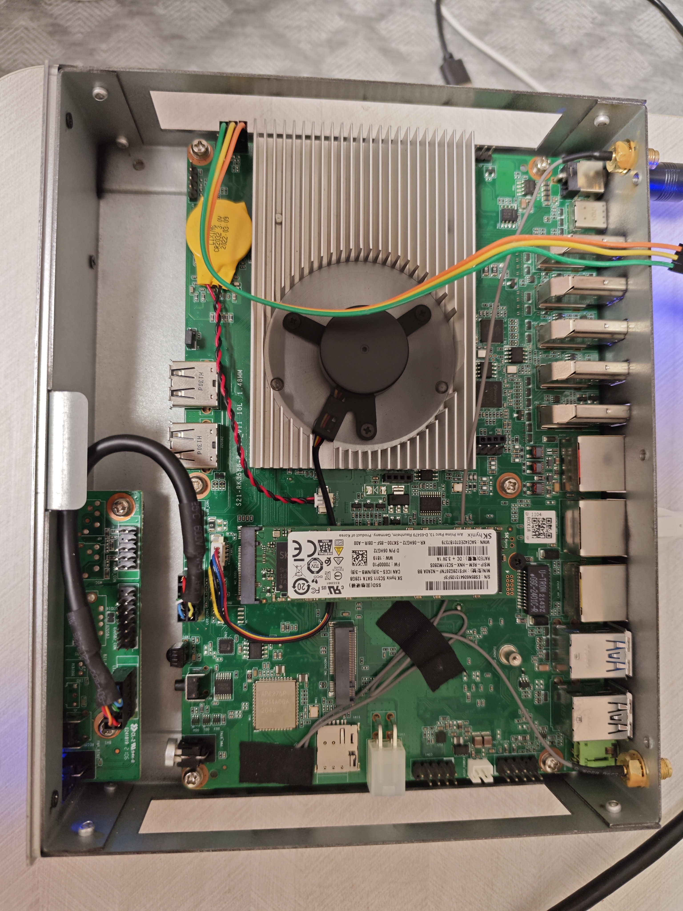
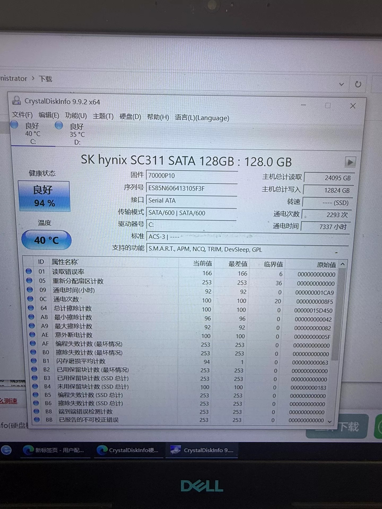
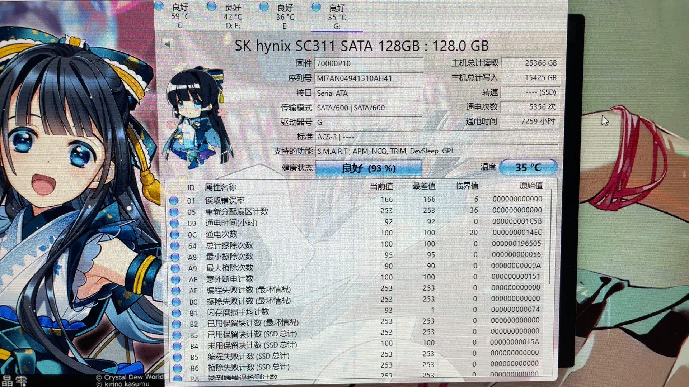

# 硬件规格


















## M2 SATA盘 - ES85N606413105F3F



顺丰

```shell

root@armbian:~# smartctl -a /dev/sda
smartctl 7.4 2023-08-01 r5530 [aarch64-linux-5.10.66] (local build)
Copyright (C) 2002-23, Bruce Allen, Christian Franke, www.smartmontools.org

=== START OF INFORMATION SECTION ===
Model Family:     SK hynix SATA SSDs
Device Model:     SK hynix SC311 SATA 128GB
Serial Number:    ES85N606413105F3F
Firmware Version: 70000P10
User Capacity:    128,035,676,160 bytes [128 GB]
Sector Sizes:     512 bytes logical, 4096 bytes physical
Rotation Rate:    Solid State Device
Form Factor:      M.2
TRIM Command:     Available, deterministic, zeroed
Device is:        In smartctl database 7.3/5528
ATA Version is:   ACS-3 (minor revision not indicated)
SATA Version is:  SATA 3.2, 6.0 Gb/s (current: 6.0 Gb/s)
Local Time is:    Fri Sep 25 10:14:06 2026 UTC
SMART support is: Available - device has SMART capability.
SMART support is: Enabled

=== START OF READ SMART DATA SECTION ===
SMART overall-health self-assessment test result: PASSED

General SMART Values:
Offline data collection status:  (0x05)	Offline data collection activity
					was aborted by an interrupting command from host.
					Auto Offline Data Collection: Disabled.
Self-test execution status:      (  25)	The self-test routine was aborted by
					the host.
Total time to complete Offline 
data collection: 		(   10) seconds.
Offline data collection
capabilities: 			 (0x51) SMART execute Offline immediate.
					No Auto Offline data collection support.
					Suspend Offline collection upon new
					command.
					No Offline surface scan supported.
					Self-test supported.
					No Conveyance Self-test supported.
					Selective Self-test supported.
SMART capabilities:            (0x0002)	Does not save SMART data before
					entering power-saving mode.
					Supports SMART auto save timer.
Error logging capability:        (0x01)	Error logging supported.
					General Purpose Logging supported.
Short self-test routine 
recommended polling time: 	 (   2) minutes.
Extended self-test routine
recommended polling time: 	 (  20) minutes.
SCT capabilities: 	       (0x003d)	SCT Status supported.
					SCT Error Recovery Control supported.
					SCT Feature Control supported.
					SCT Data Table supported.

SMART Attributes Data Structure revision number: 0
Vendor Specific SMART Attributes with Thresholds:
ID# ATTRIBUTE_NAME          FLAG     VALUE WORST THRESH TYPE      UPDATED  WHEN_FAILED RAW_VALUE
  1 Raw_Read_Error_Rate     0x000f   166   166   006    Pre-fail  Always       -       0
  5 Retired_Block_Count     0x0032   253   253   036    Old_age   Always       -       0
  9 Power_On_Hours          0x0032   092   092   000    Old_age   Always       -       7337
 12 Power_Cycle_Count       0x0032   100   100   020    Old_age   Always       -       2294
100 Total_Erase_Count       0x0032   100   100   000    Old_age   Always       -       1430928
168 Min_Erase_Count         0x0032   096   096   000    Old_age   Always       -       66
169 Max_Erase_Count         0x0032   092   092   000    Old_age   Always       -       130
174 Unexpect_Power_Loss_Ct  0x0030   100   100   000    Old_age   Offline      -       95
175 Program_Fail_Count_Chip 0x0032   253   253   000    Old_age   Always       -       0
176 Unused_Rsvd_Blk_Cnt_Tot 0x0032   253   253   000    Old_age   Always       -       0
177 Wear_Leveling_Count     0x0032   094   001   000    Old_age   Always       -       99
178 Used_Rsvd_Blk_Cnt_Chip  0x0032   253   253   000    Old_age   Always       -       0
179 Used_Rsvd_Blk_Cnt_Tot   0x0032   253   253   000    Old_age   Always       -       0
180 Erase_Fail_Count        0x0032   100   100   000    Old_age   Always       -       387
181 Non4k_Aligned_Access    0x0032   253   253   000    Old_age   Always       -       0
182 Erase_Fail_Count_Total  0x0032   253   253   000    Old_age   Always       -       0
184 End-to-End_Error        0x0032   253   253   000    Old_age   Always       -       0
187 Reported_Uncorrect      0x0032   253   253   000    Old_age   Always       -       0
188 Command_Timeout         0x0032   100   100   000    Old_age   Always       -       375
194 Temperature_Celsius     0x0002   031   005   000    Old_age   Always       -       31 (Min/Max 5/53)
195 Hardware_ECC_Recovered  0x0032   253   253   000    Old_age   Always       -       0
196 Reallocated_Event_Count 0x0032   253   253   036    Old_age   Always       -       0
198 Offline_Uncorrectable   0x0032   253   253   000    Old_age   Always       -       0
199 UDMA_CRC_Error_Count    0x0032   253   253   000    Old_age   Always       -       0
204 Soft_ECC_Correction     0x000e   100   001   000    Old_age   Always       -       65947
212 Phy_Error_Count         0x0032   100   100   000    Old_age   Always       -       25104294
233 Media_Wearout_Indicator 0x0032   007   001   000    Old_age   Always       -       94
234 Unknown_SK_hynix_Attrib 0x0032   100   100   000    Old_age   Always       -       26295914208
241 Total_Writes_GB         0x0032   100   100   000    Old_age   Always       -       26895837085
242 Total_Reads_GB          0x0032   100   100   000    Old_age   Always       -       50533225874

SMART Error Log Version: 0
No Errors Logged

SMART Self-test log structure revision number 1
Num  Test_Description    Status                  Remaining  LifeTime(hours)  LBA_of_first_error
# 1  Short offline       Aborted by host               90%      7333         -
# 2  Short offline       Completed without error       00%      3707         -
# 3  Short offline       Interrupted (host reset)      90%      3069         -
# 4  Short offline       Interrupted (host reset)      90%      2175         -

Warning! SMART Selective Self-Test Log Structure error: invalid SMART checksum.
SMART Selective self-test log data structure revision number 0
Note: revision number not 1 implies that no selective self-test has ever been run
 SPAN  MIN_LBA  MAX_LBA  CURRENT_TEST_STATUS
    1        0        0  Not_testing
    2        0        0  Not_testing
    3        0        0  Not_testing
    4        0        0  Not_testing
    5        0        0  Not_testing
Selective self-test flags (0x0):
  After scanning selected spans, do NOT read-scan remainder of disk.
If Selective self-test is pending on power-up, resume after 0 minute delay.

The above only provides legacy SMART information - try 'smartctl -x' for more

root@armbian:~#  smartctl -t long /dev/sda
smartctl 7.4 2023-08-01 r5530 [aarch64-linux-5.10.66] (local build)
Copyright (C) 2002-23, Bruce Allen, Christian Franke, www.smartmontools.org

=== START OF OFFLINE IMMEDIATE AND SELF-TEST SECTION ===
Sending command: "Execute SMART Extended self-test routine immediately in off-line mode".
Drive command "Execute SMART Extended self-test routine immediately in off-line mode" successful.
Testing has begun.
Please wait 20 minutes for test to complete.
Test will complete after Fri Sep 25 10:37:30 2026 UTC
Use smartctl -X to abort test.
root@armbian:~# smartctl -l selftest /dev/sda
smartctl 7.4 2023-08-01 r5530 [aarch64-linux-5.10.66] (local build)
Copyright (C) 2002-23, Bruce Allen, Christian Franke, www.smartmontools.org

=== START OF READ SMART DATA SECTION ===
SMART Self-test log structure revision number 1
Num  Test_Description    Status                  Remaining  LifeTime(hours)  LBA_of_first_error
# 1  Short offline       Aborted by host               90%      7333         -
# 2  Short offline       Completed without error       00%      3707         -
# 3  Short offline       Interrupted (host reset)      90%      3069         -
# 4  Short offline       Interrupted (host reset)      90%      2175         -

root@armbian:~# smartctl -l selftest /dev/sda
smartctl 7.4 2023-08-01 r5530 [aarch64-linux-5.10.66] (local build)
Copyright (C) 2002-23, Bruce Allen, Christian Franke, www.smartmontools.org

=== START OF READ SMART DATA SECTION ===
SMART Self-test log structure revision number 1
Num  Test_Description    Status                  Remaining  LifeTime(hours)  LBA_of_first_error
# 1  Short offline       Aborted by host               90%      7333         -
# 2  Short offline       Completed without error       00%      3707         -
# 3  Short offline       Interrupted (host reset)      90%      3069         -
# 4  Short offline       Interrupted (host reset)      90%      2175         -

root@armbian:~# 
root@armbian:~# 
root@armbian:~# 
root@armbian:~# 
root@armbian:~# smartctl -l selftest /dev/sda
smartctl 7.4 2023-08-01 r5530 [aarch64-linux-5.10.66] (local build)
Copyright (C) 2002-23, Bruce Allen, Christian Franke, www.smartmontools.org

=== START OF READ SMART DATA SECTION ===
SMART Self-test log structure revision number 1
Num  Test_Description    Status                  Remaining  LifeTime(hours)  LBA_of_first_error
# 1  Extended offline    Completed without error       00%      7337         -
# 2  Short offline       Aborted by host               90%      7333         -
# 3  Short offline       Completed without error       00%      3707         -
# 4  Short offline       Interrupted (host reset)      90%      3069         -
# 5  Short offline       Interrupted (host reset)      90%      2175         -

root@armbian:~# 


```


这块 SK hynix SC311 128GB SSD（序列号 ES85N...）的健康状况可以总结为：**物理介质完好，但使用寿命已接近极限**。

虽然刚刚通过的 Extended Self-test（扩展自检）证明盘片目前没有坏块和读取错误，但磨损指标显示它已经处于“退役边缘”。

以下是详细分析：

### 1. ✅ 好消息：当前物理状态健康
-   **Extended Self-test PASSED：** 你刚刚执行的长测试（#1 Extended offline）在 7337 小时寿命点**无错误完成**。这非常重要，说明 NAND 闪存颗粒目前仍能正确读写，没有产生不可纠正的位错误。
-   **关键故障计数均为 0：**
    -   `5 Retired_Block_Count`: 0（无退役/坏块）
    -   `187 Reported_Uncorrect`: 0（无未纠正错误）
    -   `198 Offline_Uncorrectable`: 0
    -   `199 UDMA_CRC_Error_Count`: 0（SATA 链路通信正常）
-   **温度正常：** 当前 31°C，历史最高 53°C，工作在安全范围内。

### 2. ⚠️ 核心警告：寿命即将耗尽

| ID | 属性 | 值 | 解读 |
| :--- | :--- | :--- | :--- |
| **233** | Media_Wearout_Indicator | **VALUE=7** (WORST=1) | **最关键指标**。SK hynix 的寿命指示器从 100 递减。**剩余仅 7%**，历史最低曾到 1。官方额定写入寿命已基本用完。 |
| **177** | Wear_Leveling_Count | VALUE=94, RAW=99 | 平均擦写次数约 99 次（归一化），与 ID 168/169 的 Min/Max Erase Count (66/130) 吻合，磨损均衡良好，但整体已老化。 |
| **241** | Total_Writes_GB | ~26.9 TB | 对于 128GB 盘，相当于 **~210 DWPD**，写入量非常大。 |
| **204** | Soft_ECC_Correction | RAW=65,947 | 软纠错次数较高（相比同型号另一块盘的 320 次高出两个数量级），说明 NAND 单元保持电荷的能力已明显下降，主控需要频繁纠错。**这是颗粒老化的直接信号**。 |

### 3. 🔍 其他观察
-   **Power_On_Hours:** 7,337 小时 ≈ **306 天**连续运行
-   **Unexpect_Power_Loss_Ct:** 95 次（意外断电较多，但比上一块盘的 337 次好很多）
-   **Command_Timeout:** 375 次（偏高，可能因主控忙于 ECC 纠错导致响应延迟）
-   **Phy_Error_Count (212):** ~2500 万，PHY 层信号错误计数高，但 CRC 错误为 0，通常不代表实际故障，可能是 SATA 控制器统计特性
-   **Selective Self-Test Log checksum invalid：** SK hynix 固件已知问题，不影响使用

### 4. 📊 与你上一块同型号盘的对比

| 指标 | 上一块 (MI7AN...) | 这一块 (ES85N...) | 评价 |
| :--- | :--- | :--- | :--- |
| Media_Wearout (233) | VALUE=8 | **VALUE=7** | 这块磨损更严重 |
| Soft_ECC (204) | 320 | **65,947** | 这块颗粒老化更明显 |
| Retired Blocks (5) | 0 | 0 | 两者都无坏块 |
| Extended Test | 未执行 | **PASSED** | 这块刚通过完整验证 |
| 意外断电 (174) | 337 | 95 | 这块供电环境更好 |

### 5. 📋 建议

> **结论：盘还能用，但随时可能因磨损达到阈值而被固件锁定为只读模式。**

1.  **Extended Test 通过 ≠ 寿命充足** — 自检只验证当前可读性，不预测剩余寿命。VALUE=7 意味着写入余量极少。
2.  **立即备份数据** — 不要依赖此盘存储任何不可替代的数据。
3.  **Soft ECC 飙升是预警** — 65,947 次软纠错说明读取时信号质量已很差，未来可能出现读取变慢或突然无法纠正的错误。
4.  **计划更换** — 该盘已完成其历史使命，建议尽快替换。如需临时继续使用，仅用于可重建的缓存/临时数据。
5.  **持续监控** — 若暂不更换，每周检查一次 ID 233 和 ID 204。当 233 VALUE ≤ 3 或 204 RAW 急剧增长时，应立即停用。


## M2 SATA盘 - MI7AN04941310AH41



* 青岛

```shell
root@armbian:~# 
root@armbian:~# smartctl -a /dev/sda
smartctl 7.4 2023-08-01 r5530 [aarch64-linux-5.10.66] (local build)
Copyright (C) 2002-23, Bruce Allen, Christian Franke, www.smartmontools.org

=== START OF INFORMATION SECTION ===
Model Family:     SK hynix SATA SSDs
Device Model:     SK hynix SC311 SATA 128GB
Serial Number:    MI7AN04941310AH41
Firmware Version: 70000P10
User Capacity:    128,035,676,160 bytes [128 GB]
Sector Sizes:     512 bytes logical, 4096 bytes physical
Rotation Rate:    Solid State Device
Form Factor:      M.2
TRIM Command:     Available, deterministic, zeroed
Device is:        In smartctl database 7.3/5528
ATA Version is:   ACS-3 (minor revision not indicated)
SATA Version is:  SATA 3.2, 6.0 Gb/s (current: 6.0 Gb/s)
Local Time is:    Fri Sep 25 12:04:11 2026 UTC
SMART support is: Available - device has SMART capability.
SMART support is: Enabled

=== START OF READ SMART DATA SECTION ===
SMART overall-health self-assessment test result: PASSED

General SMART Values:
Offline data collection status:  (0x02)	Offline data collection activity
					was completed without error.
					Auto Offline Data Collection: Disabled.
Self-test execution status:      (   0)	The previous self-test routine completed
					without error or no self-test has ever 
					been run.
Total time to complete Offline 
data collection: 		(  110) seconds.
Offline data collection
capabilities: 			 (0x51) SMART execute Offline immediate.
					No Auto Offline data collection support.
					Suspend Offline collection upon new
					command.
					No Offline surface scan supported.
					Self-test supported.
					No Conveyance Self-test supported.
					Selective Self-test supported.
SMART capabilities:            (0x0002)	Does not save SMART data before
					entering power-saving mode.
					Supports SMART auto save timer.
Error logging capability:        (0x01)	Error logging supported.
					General Purpose Logging supported.
Short self-test routine 
recommended polling time: 	 (   2) minutes.
Extended self-test routine
recommended polling time: 	 (  20) minutes.
SCT capabilities: 	       (0x003d)	SCT Status supported.
					SCT Error Recovery Control supported.
					SCT Feature Control supported.
					SCT Data Table supported.

SMART Attributes Data Structure revision number: 0
Vendor Specific SMART Attributes with Thresholds:
ID# ATTRIBUTE_NAME          FLAG     VALUE WORST THRESH TYPE      UPDATED  WHEN_FAILED RAW_VALUE
  1 Raw_Read_Error_Rate     0x000f   166   166   006    Pre-fail  Always       -       0
  5 Retired_Block_Count     0x0032   253   253   036    Old_age   Always       -       0
  9 Power_On_Hours          0x0032   092   092   000    Old_age   Always       -       7260
 12 Power_Cycle_Count       0x0032   100   100   020    Old_age   Always       -       5357
100 Total_Erase_Count       0x0032   100   100   000    Old_age   Always       -       1664261
168 Min_Erase_Count         0x0032   095   095   000    Old_age   Always       -       86
169 Max_Erase_Count         0x0032   090   090   000    Old_age   Always       -       154
174 Unexpect_Power_Loss_Ct  0x0030   100   100   000    Old_age   Offline      -       337
175 Program_Fail_Count_Chip 0x0032   253   253   000    Old_age   Always       -       0
176 Unused_Rsvd_Blk_Cnt_Tot 0x0032   253   253   000    Old_age   Always       -       0
177 Wear_Leveling_Count     0x0032   093   001   000    Old_age   Always       -       116
178 Used_Rsvd_Blk_Cnt_Chip  0x0032   253   253   000    Old_age   Always       -       0
179 Used_Rsvd_Blk_Cnt_Tot   0x0032   253   253   000    Old_age   Always       -       0
180 Erase_Fail_Count        0x0032   100   100   000    Old_age   Always       -       346
181 Non4k_Aligned_Access    0x0032   253   253   000    Old_age   Always       -       0
182 Erase_Fail_Count_Total  0x0032   253   253   000    Old_age   Always       -       0
184 End-to-End_Error        0x0032   253   253   000    Old_age   Always       -       0
187 Reported_Uncorrect      0x0032   253   253   000    Old_age   Always       -       0
188 Command_Timeout         0x0032   100   100   000    Old_age   Always       -       441
194 Temperature_Celsius     0x0002   029   013   000    Old_age   Always       -       29 (Min/Max 13/52)
195 Hardware_ECC_Recovered  0x0032   253   253   000    Old_age   Always       -       0
196 Reallocated_Event_Count 0x0032   253   253   036    Old_age   Always       -       0
198 Offline_Uncorrectable   0x0032   253   253   000    Old_age   Always       -       0
199 UDMA_CRC_Error_Count    0x0032   253   253   000    Old_age   Always       -       0
204 Soft_ECC_Correction     0x000e   100   001   000    Old_age   Always       -       320
212 Phy_Error_Count         0x0032   100   100   000    Old_age   Always       -       13977629
233 Media_Wearout_Indicator 0x0032   008   001   000    Old_age   Always       -       93
234 Unknown_SK_hynix_Attrib 0x0032   100   100   000    Old_age   Always       -       30388781776
241 Total_Writes_GB         0x0032   100   100   000    Old_age   Always       -       32350413889
242 Total_Reads_GB          0x0032   100   100   000    Old_age   Always       -       53196648744

SMART Error Log Version: 0
No Errors Logged

SMART Self-test log structure revision number 1
Num  Test_Description    Status                  Remaining  LifeTime(hours)  LBA_of_first_error
# 1  Short offline       Completed without error       00%      7145         -
# 2  Short offline       Aborted by host               90%      7030         -
# 3  Short offline       Completed without error       00%      6372         -
# 4  Short offline       Completed without error       00%      6227         -
# 5  Short offline       Aborted by host               80%      6135         -
# 6  Short offline       Completed without error       00%      6018         -
# 7  Short offline       Completed without error       00%      4446         -
# 8  Short offline       Completed without error       00%      4446         -
# 9  Short offline       Completed without error       00%      4301         -
#10  Short offline       Aborted by host               80%      4301         -
#11  Short offline       Completed without error       00%      4301         -
#12  Short offline       Completed without error       00%      4301         -
#13  Short offline       Aborted by host               50%      4301         -
#14  Short offline       Interrupted (host reset)      90%      3681         -
#15  Short offline       Completed without error       00%      2930         -
#16  Short offline       Aborted by host               80%      2519         -
#17  Short offline       Completed without error       00%      2519         -
#18  Short offline       Completed without error       00%         0         -

Warning! SMART Selective Self-Test Log Structure error: invalid SMART checksum.
SMART Selective self-test log data structure revision number 0
Note: revision number not 1 implies that no selective self-test has ever been run
 SPAN  MIN_LBA  MAX_LBA  CURRENT_TEST_STATUS
    1        0        0  Not_testing
    2        0        0  Not_testing
    3        0        0  Not_testing
    4        0        0  Not_testing
    5        0        0  Not_testing
Selective self-test flags (0x0):
  After scanning selected spans, do NOT read-scan remainder of disk.
If Selective self-test is pending on power-up, resume after 0 minute delay.

The above only provides legacy SMART information - try 'smartctl -x' for more

root@armbian:~# 

```

这块 SK hynix SC311 128GB SSD 目前 **SMART 自检状态为 PASSED**，且没有记录到致命错误日志，但从底层属性来看，它已经处于 **严重磨损/寿命末期** 状态。

以下是详细分析：

### ⚠️ 核心风险指标（寿命相关）

| 属性 ID | 名称 | 当前值 / 原始值 | 解读 |
| :--- | :--- | :--- | :--- |
| **233** | Media_Wearout_Indicator | VALUE=**8**, RAW=93 | **最关键指标**。SK hynix 的磨损指示器，VALUE 从 100 递减到 0。**当前仅剩 8%**，说明官方额定写入寿命已消耗超过 90%。 |
| **177** | Wear_Leveling_Count | VALUE=93, WORST=**1** | 磨损均衡计数。历史最差值曾降至 1，说明某些区块曾接近磨损极限，虽经均衡算法缓解，但整体颗粒老化严重。 |
| **5** | Retired_Block_Count | VALUE=253, RAW=0 | 退役块（坏块）数量目前为 0，这是唯一的好消息，说明尚未出现物理损坏的块。 |
| **168/169** | Min/Max Erase Count | 86 / 154 | 最小与最大擦写次数差距不大（86 vs 154），说明磨损均衡算法工作正常，颗粒磨损相对均匀。 |

### 📊 使用强度统计

-   **通电时间：** 7,260 小时 ≈ **302 天**（约 10 个月连续运行）
-   **通电次数：** 5,357 次（平均每次通电仅 ~1.3 小时，频繁开关机或休眠唤醒）
-   **总写入量：** ~32.3 TB（RAW 值换算，对于 128GB 盘来说相当于 **~250 DWPD**，写入量极大）
-   **总读取量：** ~53.2 TB
-   **意外断电：** 337 次（较高，可能影响数据完整性）
-   **命令超时：** 441 次（偏高，可能与主控响应变慢或供电不稳有关）

### ✅ 健康指标（暂无异常）

-   **Reallocated / Uncorrectable / CRC Error：** 全部为 0，无物理坏道和传输错误
-   **Temperature：** 29°C（最低 13°C / 最高 52°C），温度正常
-   **Hardware ECC / Soft ECC：** 有少量软纠错（320 次），但在 NAND 老化阶段属于正常范围
-   **Error Log：** 无错误记录

### 🔍 注意事项

-   **Selective Self-Test Log checksum invalid：** 选择性自检日志校验和无效，这通常是 SK hynix 固件的已知小问题，不影响实际使用，但建议用 `smartctl -x` 获取更完整信息确认。
-   **Phy_Error_Count (212)：** 原始值高达 ~1400 万，这是 PHY 层信号错误计数，在 SATA SSD 上通常不代表故障，但结合命令超时较多，建议检查 SATA 线缆/接口是否接触良好。

### 📋 综合评估与建议

> **结论：该 SSD 功能正常但寿命即将耗尽，属于"可用但不可信"状态。**

1.  **立即备份所有重要数据** — 剩余 8% 的磨损余量意味着随时可能出现写入失败或掉盘
2.  **不建议继续作为系统盘或存储重要数据** — 可降级为临时缓存/下载盘等非关键用途
3.  **计划更换** — 128GB 容量本身较小，建议升级到更大容量的新 SSD（大容量 SSD 寿命更长、性能更好）
4.  **监控频率加密** — 如暂时继续使用，建议每周执行一次 `smartctl -a /dev/sda` 并关注 ID 233 的变化趋势，若 VALUE 降到 5 以下应立刻停用
5.  **检查供电与连接** — 针对命令超时和 PHY 错误，重新插拔或更换 SATA 线缆，确保 Armbian 设备供电稳定

